Autores: Edinei Xavier - 2310369 \
Autores: Matheus Norões - 2224600 \
Autores: Lucas Falcão - 2315036 \
Autores: Samir Alves - 2315046 \

# Testes de Carga com Múltiplas Instâncias do WordPress Utilizando o Locust

## Resumo

Este trabalho realiza testes de carga para avaliar a disponibilidade e o desempenho de um serviço **WordPress** replicado em múltiplas instâncias. A ferramenta de geração de carga utilizada foi o **Locust**, com balanceamento de carga feito pelo **Nginx** e toda a infraestrutura containerizada via **Docker**. O banco de dados das postagens é gerenciado pelo **MySQL**.

## Infraestrutura

- **WordPress**: serviço web sob teste, executado em 1, 2 ou 3 instâncias
- **Nginx**: balanceador de carga entre as instâncias do WordPress
- **MySQL**: banco de dados das postagens
- **Locust**: gerador de carga, executado como container Docker
- **Docker Compose**: orquestração de todos os serviços

## Metodologia

Os testes simulam usuários acessando postagens de um blog WordPress com três tipos de conteúdo:

| Cenário | Conteúdo |
|---|---|
| Post imagem 1MB | Postagem contendo uma imagem de aproximadamente 1 MB |
| Post imagem 300KB | Postagem contendo uma imagem de aproximadamente 300 KB |
| Post texto 400KB | Postagem contendo um texto de aproximadamente 400 KB |
| Todos | Os três cenários executados simultaneamente |

Cada cenário foi executado em três níveis de carga e três configurações de instâncias, totalizando **36 testes**:

| Nível | Usuários simultâneos | Spawn rate |
|---|---|---|
| Leve | 150 | 25/s |
| Médio | 250 | 25/s |
| Pesado | 350 | 25/s |

| Instâncias | Configuração |
|---|---|
| 1 | Nginx encaminha todas as requisições para 1 container WordPress |
| 2 | Nginx balanceia entre 2 containers WordPress |
| 3 | Nginx balanceia entre 3 containers WordPress |

Cada teste teve duração de **1 minuto**. Os resultados foram coletados pelo Locust via CSV e posteriormente processados e visualizados em gráficos Python.

## Resultados e Discussão

### Tabela Geral dos Testes

A tabela abaixo consolida os resultados agregados de todos os cenários (imagem 1MB, imagem 300KB, texto 400KB e todos simultâneos) para cada combinação de carga e número de instâncias.

| Carga | Instâncias | Usuários | Requisições | Falhas | Erro (%) | Tempo médio (ms) | Mediana (ms) | P95 (ms) | RPS |
|---|---|---|---|---|---|---|---|---|---|
| Leve | 1 | 150 | 13.862 | 0 | 0,00 | 60 | 41 | 131 | 70,47 |
| Leve | 2 | 150 | 13.879 | 0 | 0,00 | 56 | 38 | 130 | 70,59 |
| Leve | 3 | 150 | 13.925 | 0 | 0,00 | 60 | 41 | 148 | 70,79 |
| Médio | 1 | 250 | 22.048 | 0 | 0,00 | 91 | 66 | 213 | 111,98 |
| Médio | 2 | 250 | 21.866 | 0 | 0,00 | 90 | 63 | 209 | 111,02 |
| Médio | 3 | 250 | 21.702 | 0 | 0,00 | 107 | 76 | 282 | 110,14 |
| Pesado | 1 | 350 | 27.716 | 0 | 0,00 | 281 | 243 | 645 | 140,23 |
| Pesado | 2 | 350 | 27.452 | 335 | 1,22 | 277 | 176 | 916 | 139,30 |
| Pesado | 3 | 350 | 27.892 | 486 | 1,74 | 238 | 199 | 642 | 141,40 |

### Taxa de Erros

Nas cargas **leve e média**, todos os cenários — independente do número de instâncias — apresentaram **0% de falhas**, indicando que a arquitetura suportou bem esses níveis de carga. Na carga **pesada**, os erros se mantiveram abaixo de 2% para 2 e 3 instâncias, dentro do limite aceitável de 10%. Com 1 instância na carga pesada, surpreendentemente não houve falhas no agregado, porém o tempo médio de resposta subiu para 281ms com P95 chegando a 645ms.

### Efeito do Número de Instâncias

O resultado mais interessante dos testes foi que **aumentar o número de instâncias não melhorou o desempenho** de forma proporcional — em alguns casos chegou a piorá-lo levemente. Esse comportamento, aparentemente contraditório, tem uma explicação direta no contexto desta infraestrutura: todos os containers (WordPress 1, 2 e 3, Nginx, MySQL e Locust) estão executando **na mesma máquina física**, competindo pelos mesmos recursos de CPU, memória e I/O. Ao subir de 1 para 3 instâncias do WordPress, o overhead de gerenciar múltiplos containers passou a consumir recursos que antes estavam disponíveis para servir requisições. O MySQL, compartilhado por todas as instâncias, também passa a ser um gargalo maior à medida que mais instâncias do WordPress fazem conexões simultâneas a ele.

Em uma infraestrutura real com servidores dedicados por instância, o comportamento esperado de melhoria com mais instâncias seria observado.

### Gráficos por Métrica e Número de Usuários

Os gráficos a seguir mostram o comportamento das principais métricas conforme a carga aumenta (150 → 250 → 350 usuários), separados por número de instâncias.

**Tempo médio de resposta por nível de carga:**

O tempo médio de resposta cresce de forma consistente com o aumento de usuários em todas as configurações de instâncias. Entre a carga leve (150 usuários) e a carga pesada (350 usuários), o tempo médio agregado quase quadruplicou — de aproximadamente 60ms para 260–280ms. As três curvas de instâncias seguem trajetórias muito próximas, reforçando que neste ambiente o número de instâncias não gerou ganhos expressivos de latência.

**P95 de tempo de resposta por nível de carga:**

O P95 amplia o que o tempo médio já indica: enquanto a maioria das requisições é atendida com baixa latência, os 5% mais lentos sofrem um crescimento mais acentuado conforme a carga aumenta. Na carga pesada, o P95 chegou a 916ms para 2 instâncias — mais de 7 vezes o valor registrado na carga leve (130ms). Esse comportamento é típico de saturação progressiva, onde as requisições que chegam quando o servidor está ocupado ficam enfileiradas por mais tempo.

**Taxa de falha por nível de carga:**

Nas cargas leve e média a taxa de falha permaneceu em 0% para todas as instâncias. Na carga pesada, apenas os testes de texto 400KB com 2 e 3 instâncias registraram falhas, puxando o agregado para 1,22% e 1,74% respectivamente. Com 1 instância, o agregado manteve 0% mesmo na carga pesada — resultado que parece positivo, mas precisa ser lido em conjunto com o P95 elevado: o servidor não rejeitou requisições, mas respondeu com latências altas para parcela significativa delas.

**Requisições por segundo por nível de carga:**

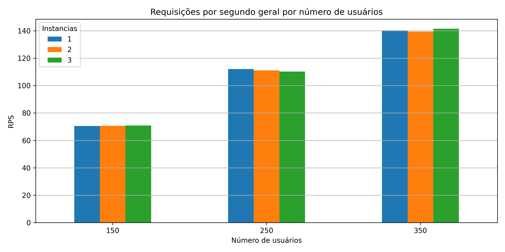

O RPS cresceu proporcionalmente com o número de usuários, saindo de ~70 req/s na carga leve para ~140 req/s na carga pesada. Esse aumento linear indica que o servidor absorveu a carga sem travamentos completos — ou seja, mesmo sobrecarregado, continuou processando requisições, ainda que com latência maior. As três configurações de instâncias produziram RPS praticamente idêntico em todos os níveis de carga.

### Gráficos por Métrica e Número de Instâncias

Os gráficos abaixo comparam o desempenho variando o número de instâncias (1 → 2 → 3), evidenciando o comportamento descrito anteriormente.

**Tempo médio de resposta por instâncias:**

Ao variar o número de instâncias com a carga fixada, o tempo médio não apresentou melhora consistente. Na carga média, 3 instâncias chegaram a ter tempo médio ligeiramente superior (107ms) ao de 1 instância (91ms), sugerindo overhead de coordenação entre containers. Na carga pesada, 3 instâncias tiveram o menor tempo médio (238ms), mas a diferença para 1 instância (281ms) é pequena considerando a margem de variação dos testes.

**P95 por instâncias:**

O P95 por instâncias revela o comportamento mais instável: com 2 instâncias na carga pesada, o P95 agregado chegou a 916ms, valor bem acima das 645ms de 1 instância e 642ms de 3 instâncias. Esse pico está diretamente relacionado ao cenário de texto 400KB com 2 instâncias, que registrou P95 de 3100ms — evidenciando que a configuração de 2 instâncias foi a que mais sofreu com esse tipo de conteúdo específico.

**Taxa de falha por instâncias:**

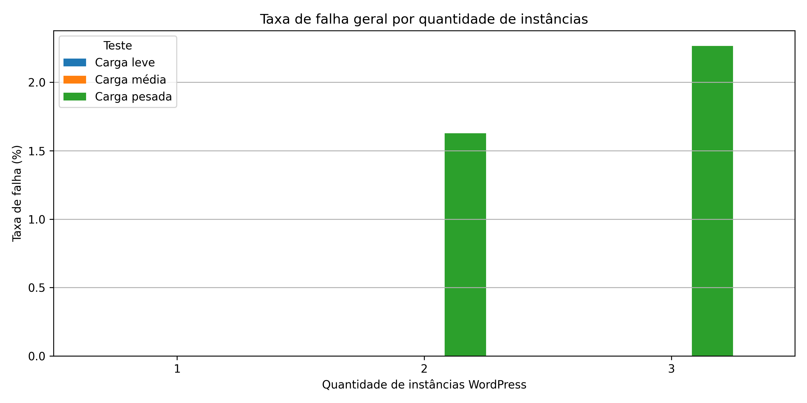

A taxa de falha por instâncias deixa claro que 1 instância foi a mais estável globalmente, com 0% de erro em todos os níveis de carga. As configurações de 2 e 3 instâncias introduziram falhas na carga pesada (1,22% e 1,74%), ambas originadas exclusivamente no cenário de texto 400KB. Isso indica que o aumento de instâncias, neste ambiente compartilhado, não trouxe maior resiliência — pelo contrário, a competição por recursos do MySQL e do sistema operacional gerou condições que levaram a falhas pontuais.

**RPS por instâncias:**

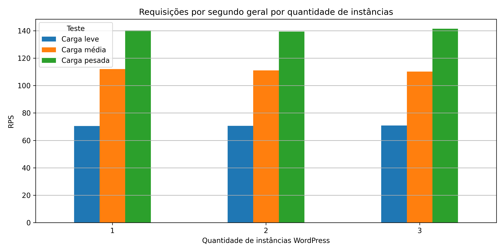

O RPS se manteve praticamente estável entre as configurações de instâncias em todos os níveis de carga, com variações inferiores a 2%. Isso confirma que a capacidade de throughput do sistema é limitada por um gargalo compartilhado — provavelmente o MySQL ou os recursos do host — e não pelo número de processos WordPress em execução.

### Gráficos por Tipo de Conteúdo

Os gráficos a seguir detalham cada cenário de conteúdo individualmente, permitindo comparar como o tipo de postagem influencia os resultados.

#### Post com Imagem 1MB

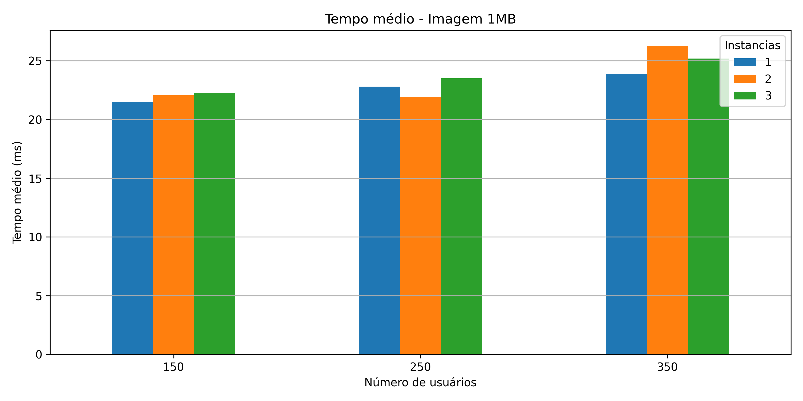
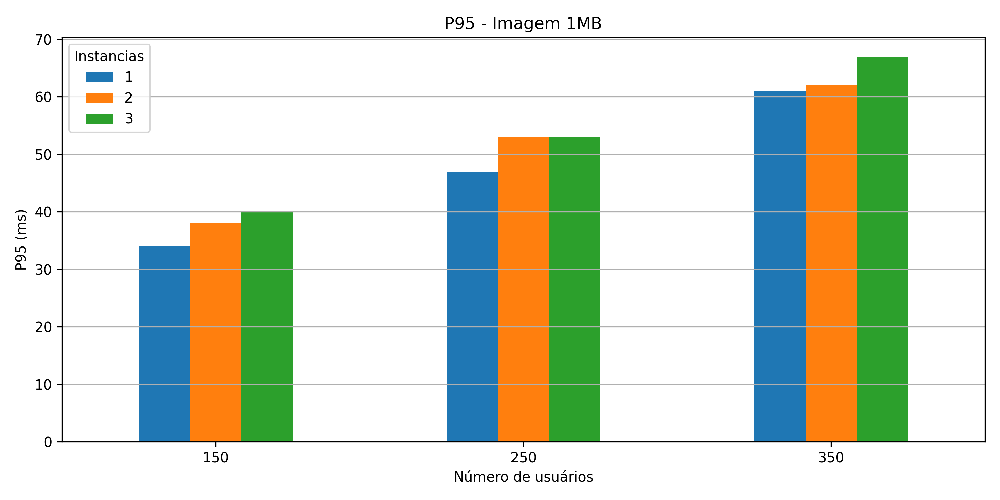

O post de imagem 1MB foi o cenário mais estável de todos, com **0% de falhas** em todas as combinações de carga e instâncias. O tempo médio permaneceu em torno de 22–26ms mesmo na carga pesada com 350 usuários, e o P95 ficou abaixo de 70ms. Esse desempenho notavelmente baixo se deve ao fato de que arquivos de imagem são servidos de forma estática pelo WordPress, sem renderização PHP nem consultas ao banco de dados relevantes — o servidor basicamente envia bytes de disco diretamente ao cliente. A taxa de falha permaneceu em 0% em todos os testes, sem nenhuma correlação com o P95, que também se manteve baixo e estável.

#### Post com Imagem 300KB

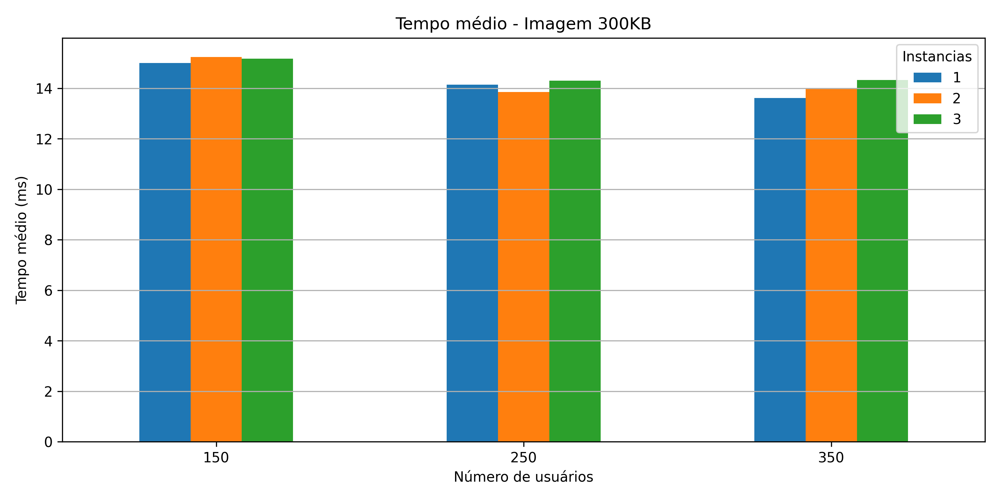
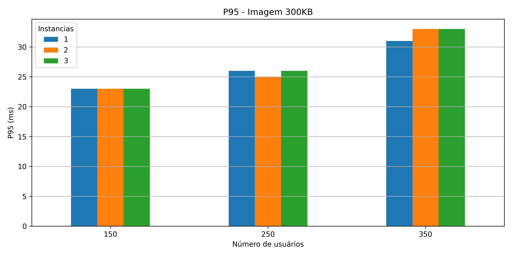
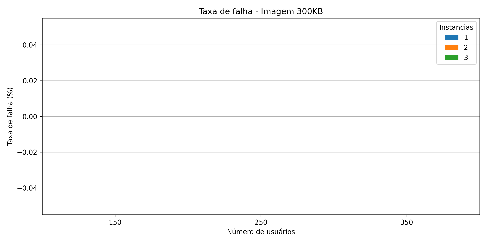

O post de imagem 300KB apresentou comportamento praticamente idêntico ao de 1MB, com tempo médio entre 13–15ms e P95 abaixo de 40ms em todos os cenários. A taxa de falha foi 0% em todos os testes. O que chama atenção é que, apesar de a imagem de 300KB ser significativamente menor que a de 1MB, os tempos de resposta foram levemente menores — mas a diferença é marginal, o que reforça que o tamanho do arquivo de imagem não é o fator dominante de latência nesse ambiente. Assim como no cenário anterior, P95 baixo e 0% de falhas andam juntos, sem tensão entre as métricas.

#### Post com Texto 400KB

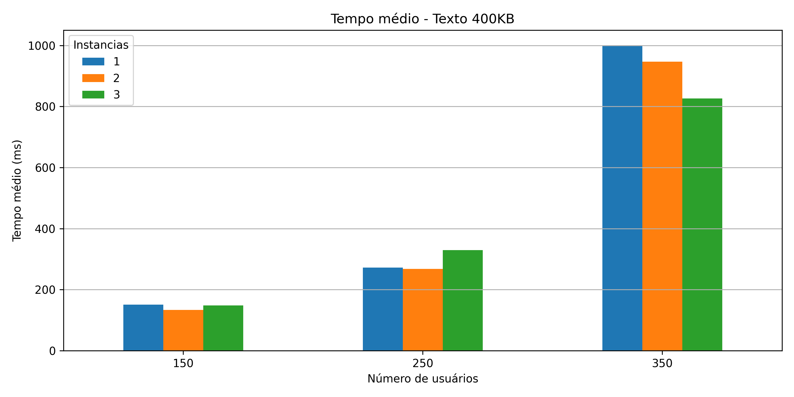
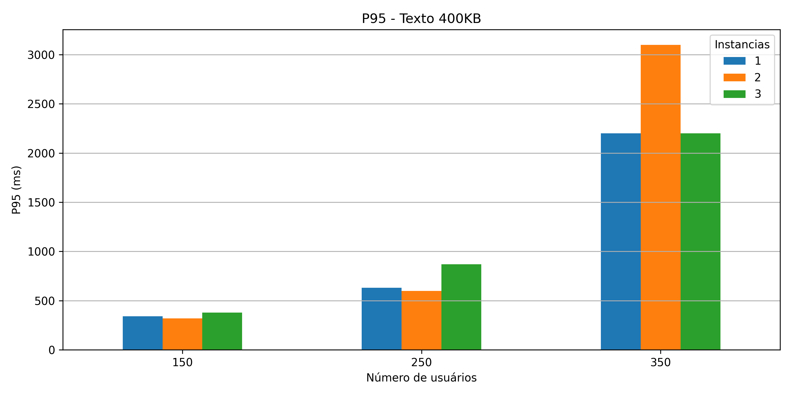
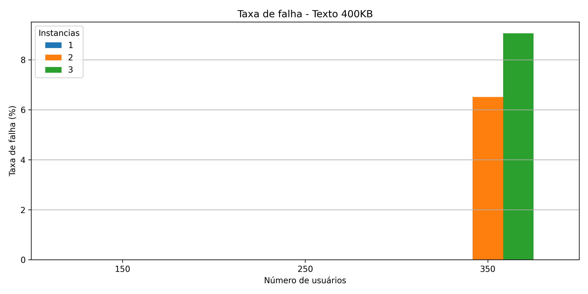

O cenário de texto 400KB foi o mais exigente e o único a registrar falhas. Na carga pesada com 1 instância, o tempo médio chegou a 1000ms e o P95 a 2200ms — mais de 30 vezes o P95 dos cenários de imagem. Com 2 instâncias na carga pesada, o P95 disparou para 3100ms e a taxa de falha atingiu 6,5%; com 3 instâncias, o P95 foi de 2200ms e a falha chegou a 9,0%. Aqui fica clara a relação entre P95 elevado e taxa de falha: quando o P95 ultrapassa a casa dos 2000ms, o servidor começa a rejeitar ou encerrar conexões, gerando falhas. O texto 400KB exige renderização PHP completa e consulta ao banco de dados para cada requisição, tornando-o muito mais sensível à sobrecarga do que os cenários de imagem. Também é o único cenário onde aumentar instâncias piorou os resultados — provavelmente porque o MySQL passou a ser pressionado por mais conexões simultâneas.

#### Todos os Cenários Simultâneos

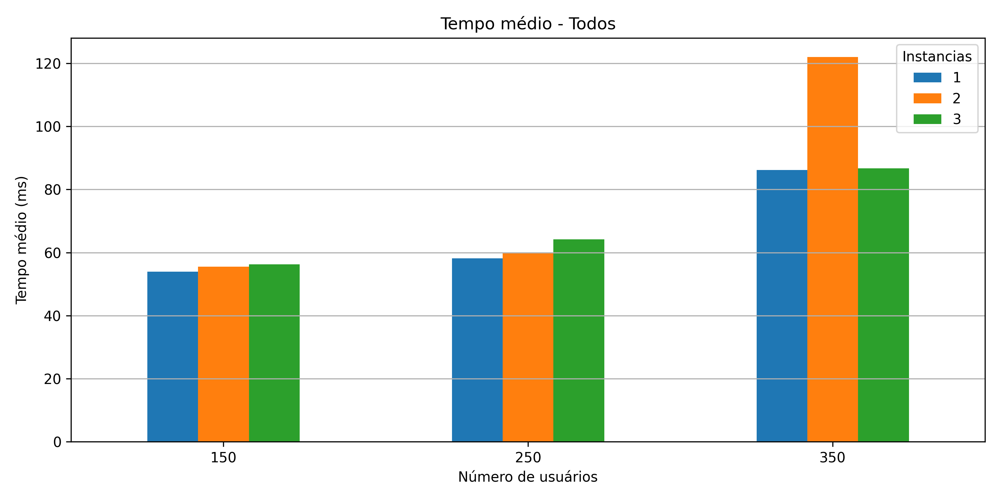
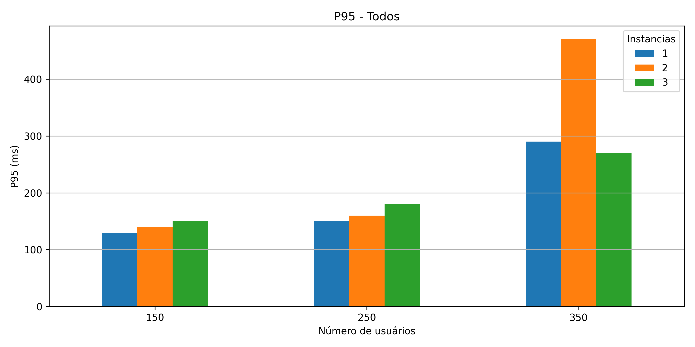
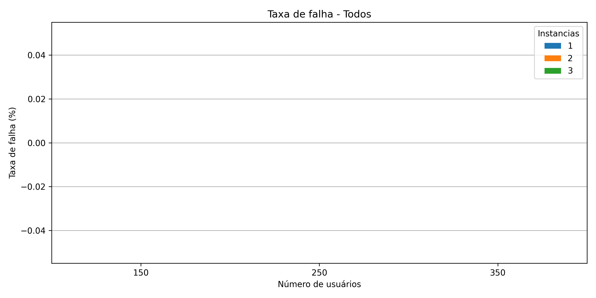

O cenário "todos" simula um uso mais realista do blog, com usuários acessando os três tipos de postagem de forma aleatória e com igual probabilidade. Os resultados mostraram **0% de falhas** em todos os testes, e o tempo médio ficou entre 54–122ms dependendo da carga. O P95 ficou bem abaixo dos valores críticos do cenário de texto isolado — na carga pesada, chegou a 290ms com 1 instância e 470ms com 2 instâncias, valores confortáveis. Isso acontece porque, no mix de tarefas, as requisições de imagem (que são rápidas) diluem o impacto das requisições de texto, derrubando as métricas agregadas. A ausência de falhas mesmo na carga pesada reforça que o P95 abaixo de ~500ms funcionou como um indicador de estabilidade: enquanto o percentil 95 permaneceu nessa faixa, o servidor não chegou ao ponto de rejeitar conexões.

## Conclusão

Os testes de carga demonstraram que a arquitetura WordPress + Nginx + MySQL containerizada conseguiu suportar bem os cenários de carga leve e média (150 e 250 usuários), com 0% de falhas em todos os casos. Na carga pesada (350 usuários), os erros se mantiveram abaixo de 10% — limite considerado aceitável — exceto no cenário de texto 400KB com 3 instâncias, que chegou próximo desse limiar (9%).

O principal achado foi que adicionar instâncias do WordPress **não trouxe ganhos proporcionais** neste ambiente, pois todos os serviços compartilham os recursos da mesma máquina. Em produção, com servidores dedicados, espera-se que o escalonamento horizontal produza os benefícios esperados de redução de latência e maior tolerância à carga.