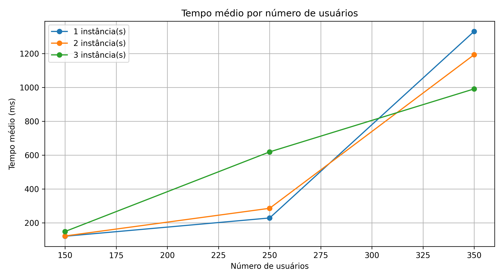
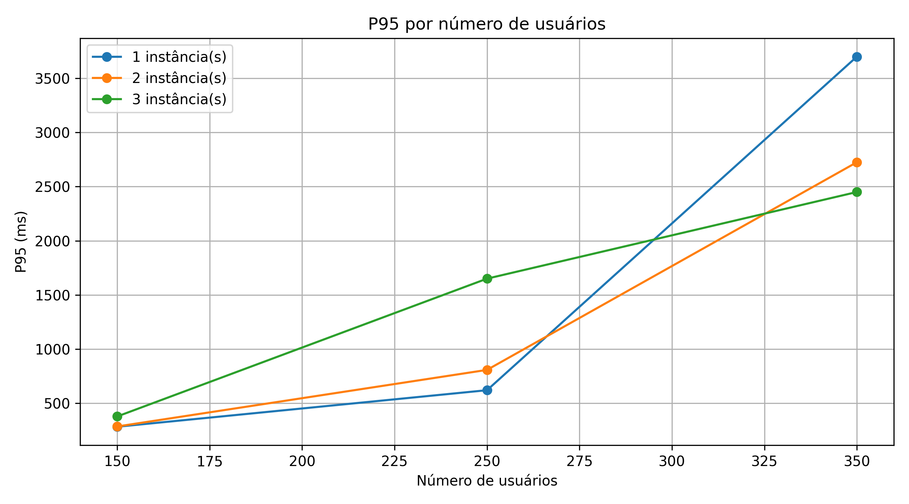
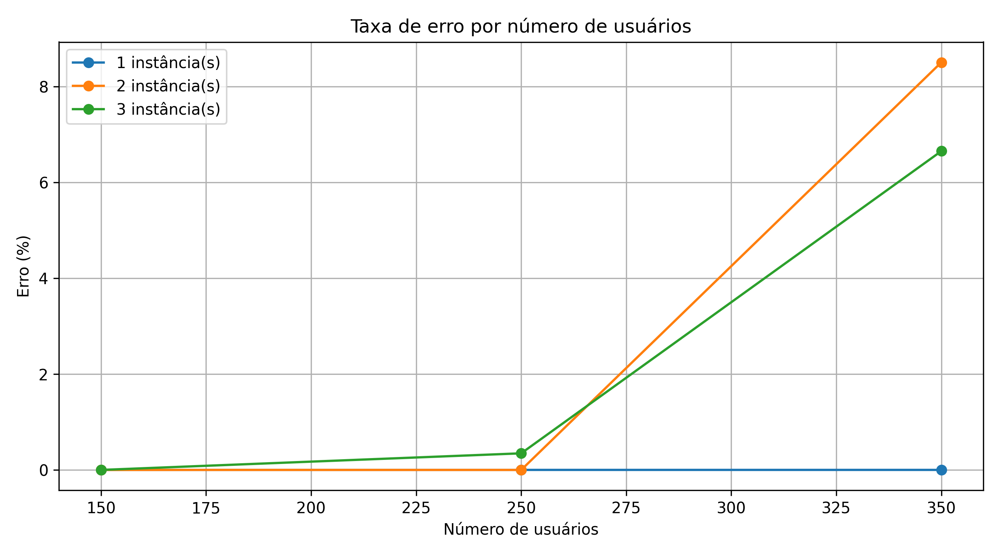
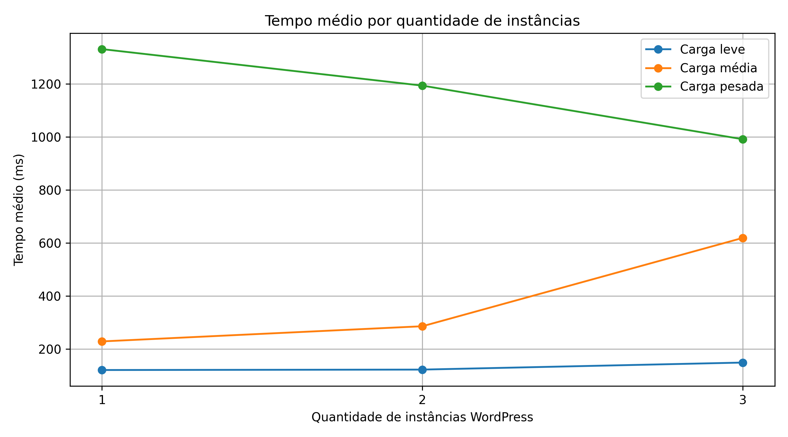
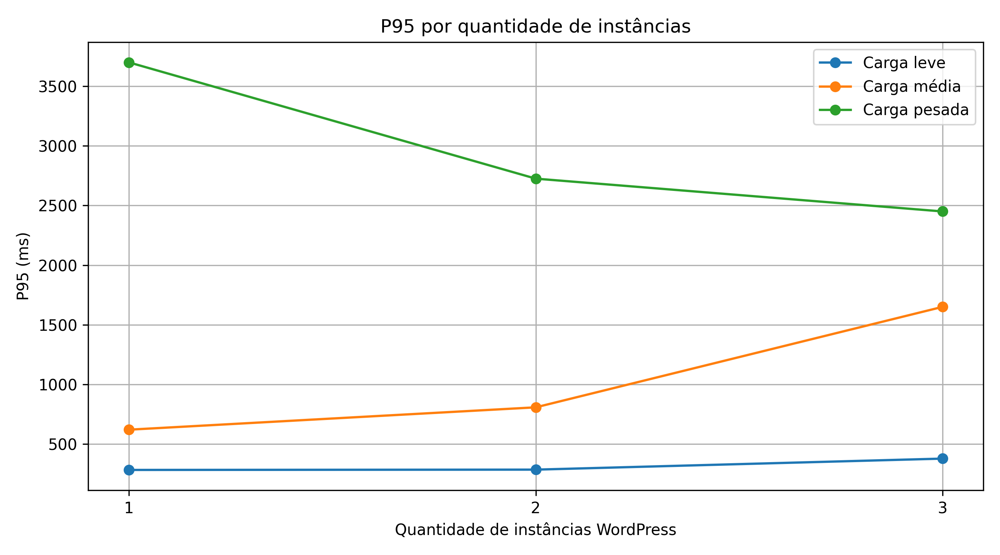
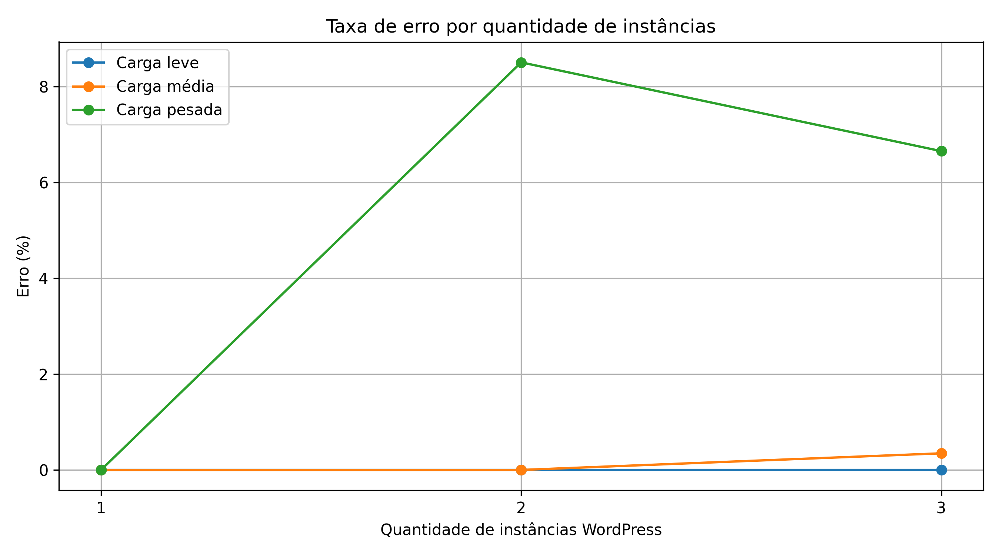
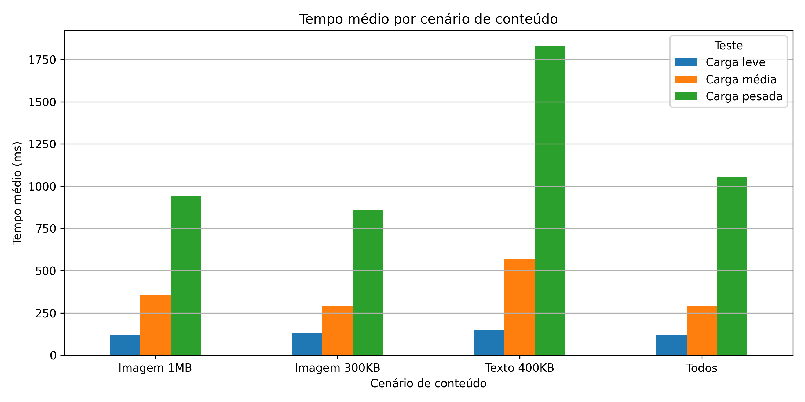

Autores: Edinei Xavier - 2310369 \
Autores: Matheus Norões - 2224600 \
Autores: Lucas Falcão - 2315036 \
Autores: Samir Alves - 2315046 \

# Resumo

Este teste de carga analisa a disponibilidade de um serviço **WordPress** em múltiplas instancias. Foi utilizada a framework de testes de carga **Locust**, O balanceador de carga **Nginx** e contêineres feitos em **Docker** foram utilizados para: Hospedagem do serviço, framework e balanceador de carga, armazenamento das postagens do blog em um banco de dados **MySQL**

# Metodologia

O teste carga realizado no Locust foram realizados em 3 postagens do blog.  A primeira postagem contia uma imagem de 1MB, a segunda contia uma imagem de 300KB e a terceira postagem contia um texto de 400KB, os testes foram separados em três categorias: Leve, Medio e Pesado. Cade teste foi realizado em um tempo máximo de 2 minutos com um numero crescente de usuários gerados e instancias do serviço.

# Resultados e Discussão

O resultados obtidos, por meio do Locust, mostraram o comportamento da disponibilidade do serviço considerando diferentes instancias disponíveis e usuários entrando por segundo.

## 1 Instancia

|Teste       |Carga |Conteudo    |Cenario          |Instancias|Usuarios|Requisicoes|Falhas|Erro|TempoMedio        |Mediana|P95   |RPS               |
|------------|------|------------|-----------------|----------|--------|-----------|------|----|------------------|-------|------|------------------|
|Carga leve  |leve  |Imagem 1MB  |post_imagem_1mb  |1         |150     |8303       |0     |0.0 |112.99800604287536|89.0   |260.0 |69.56984122092346 |
|Carga leve  |leve  |Imagem 300KB|post_imagem_300kb|1         |150     |8338       |0     |0.0 |112.09446972562854|89.0   |260.0 |69.8064656618259  |
|Carga leve  |leve  |Texto 400KB |post_texto_400kb |1         |150     |8242       |0     |0.0 |133.56153706589367|100.0  |320.0 |68.9583084981256  |
|Carga leve  |leve  |Todos       |todos            |1         |150     |8239       |0     |0.0 |123.47462854606484|97.0   |290.0 |68.95995468250192 |
|Carga média |medio |Imagem 1MB  |post_imagem_1mb  |1         |250     |13166      |0     |0.0 |181.60222667955287|120.0  |490.0 |110.14254371644074|
|Carga média |medio |Imagem 300KB|post_imagem_300kb|1         |250     |12736      |0     |0.0 |236.3302077764472 |130.0  |730.0 |107.11940723336686|
|Carga média |medio |Texto 400KB |post_texto_400kb |1         |250     |12335      |0     |0.0 |322.0372336342097 |210.0  |860.0 |103.4785971105415 |
|Carga média |medio |Todos       |todos            |1         |250     |13179      |0     |0.0 |174.0476509580328 |130.0  |400.0 |110.1361527814864 |
|Carga pesada|pesado|Imagem 1MB  |post_imagem_1mb  |1         |350     |13809      |0     |0.0 |817.4840177884905 |560.0  |2100.0|115.83337630517792|
|Carga pesada|pesado|Imagem 300KB|post_imagem_300kb|1         |350     |13812      |0     |0.0 |840.152317597068  |690.0  |2200.0|115.16097794920267|
|Carga pesada|pesado|Texto 400KB |post_texto_400kb |1         |350     |8523       |0     |0.0 |2599.8137399189177|1400.0 |7900.0|71.05431385050973 |
|Carga pesada|pesado|Todos       |todos            |1         |350     |12728      |0     |0.0 |1068.5833967250294|900.0  |2600.0|106.79120439583888|

Nos testes com 1 instancia observa-se que o serviço manteve a estabilidade em todos os cenários mesmo com o aumento de carga. Em todos os testes entravam 20 usuários por segundo

Na carga leve com 150 usuários, o sistema apresentou um bom desempenho no geral. O tempo médio de resposta ficou entre 112 e 133 milissegundos, com a mediana entre 89 e 100 e P95 abaixo de 320. A taxa de requisições por segundo manteve-se na faixa de 69 reqs/s

Na carga média, com 250 usuários, houve um aumento na latência. O tempo médio de resposta variou entre 174 e 322 milissegundos, sendo o pior a postagem do blog com o texto de 400KB. A mediana subiu para a faixa de 120 e 210 milissegundos e o P95 ficou entre 400 e 860.

Em carga pesada, com 350 usuários, o comportamento mudou de forma mais significativa. Para as postagem no blog com imagens, o tempo médio ficou na faixa de 817 ms a 840 ms, com P95 entre 2100 ms e 2200 ms, mantendo a taxa de requisições por segundo próximo de 115 req/s. No entanto, o cenário de envio de texto de 400 KB apresentou uma baixa performance. O tempo médio atingiu aproximadamente 2600 ms, com mediana de 1400 ms e P95 chegando a 7900 ms, além de queda na taxa de requisições por segundo para cerca de 71 req/s.

Nos testes de 1 instancia o serviço mostra uma ótima performance até a carga média, mas apresenta um péssimo desempenho quando a carga pesada é aplicada, especialmente no processamento da postagem com o texto. Esse problema pode ser resolvido se forem aplicada múltiplas instancias e um balanceador de carga  

## 2 Instancias

|Teste       |Carga |Conteudo    |Cenario          |Instancias|Usuarios|Requisicoes|Falhas|Erro              |TempoMedio        |Mediana|P95   |RPS               |
|------------|------|------------|-----------------|----------|--------|-----------|------|------------------|------------------|-------|------|------------------|
|Carga leve  |leve  |Imagem 1MB  |post_imagem_1mb  |2         |150     |8341       |0     |0.0               |112.71683778608492|92.0   |260.0 |69.81632462996261 |
|Carga leve  |leve  |Imagem 300KB|post_imagem_300kb|2         |150     |8318       |0     |0.0               |110.13913426592978|91.0   |260.0 |69.6338533558925  |
|Carga leve  |leve  |Texto 400KB |post_texto_400kb |2         |150     |8154       |0     |0.0               |152.53267712618356|120.0  |370.0 |68.13975046868605 |
|Carga leve  |leve  |Todos       |todos            |2         |150     |8299       |0     |0.0               |113.15065291710336|92.0   |250.0 |69.51450304565674 |
|Carga média |medio |Imagem 1MB  |post_imagem_1mb  |2         |250     |12998      |0     |0.0               |203.8485631517809 |140.0  |550.0 |108.4242021598426 |
|Carga média |medio |Imagem 300KB|post_imagem_300kb|2         |250     |13320      |0     |0.0               |161.28346832494276|120.0  |390.0 |111.2836705427109 |
|Carga média |medio |Texto 400KB |post_texto_400kb |2         |250     |11389      |0     |0.0               |493.1439323874745 |330.0  |1500.0|95.52947169921002 |
|Carga média |medio |Todos       |todos            |2         |250     |12500      |0     |0.0               |284.68267339648327|190.0  |790.0 |104.89667359132608|
|Carga pesada|pesado|Imagem 1MB  |post_imagem_1mb  |2         |350     |12301      |1319  |10.72270547109991 |1152.2931435972052|1000.0 |2800.0|103.25703826062234|
|Carga pesada|pesado|Imagem 300KB|post_imagem_300kb|2         |350     |12614      |493   |3.908355795148248 |1080.62715994617  |990.0  |2300.0|105.06572095845438|
|Carga pesada|pesado|Texto 400KB |post_texto_400kb |2         |350     |10873      |1342  |12.342499770072656|1548.1192529416824|1400.0 |3200.0|91.29184526667046 |
|Carga pesada|pesado|Todos       |todos            |2         |350     |13082      |921   |7.040207919278398 |993.8331471395172 |790.0  |2600.0|109.44622151855576|

Nos testes com 2 instancias observa-se que o serviço apresentou falhas de estabilidade, especialmente na carga pesada.

Na carga leve com 150 usuários, o desempenho do serviço manteve estável e semelhante ao teste anterior. O tempo médio de resposta ficou entre 110 e 152 milissegundos, mesmo com uma segunda instancia para fazer o balancear a carga a postagem com o texto foi a mais lenta. A mediana ficou entre 260 e 370 e P95 abaixo de 370. Os resultados indicam que não houve falhas e que o serviço está operando normalmente em múltiplas instancias.

Avançando para o teste de carga média com 250 usuários, o serviço continua estável e sem falhas. Porém apresentou um aumento considerável no tempo médio de resposta variando entre 161 e 493 sendo, novamente, a causa desse variância nos dados sendo a postagem com o texto, a mediana ficou entre 120 e 330 d P95 entre 390 e 1500. Mesmo com o aumento da latência gerada pelo postagem com o texto o serviço continuou a operar normalmente e sem falhas.

Por fim no teste de carga pesada com 350 usuários, o serviço já começou a apresentar sinais de instabilidade com a porcentagem de erro entre 3 e 12%, sendo a postagem com o texto sendo o mais critico de todos. As falhas consistem no erro HTTP de código 500, significando que as instâncias do serviço ficaram indisponíveis devido á alta demanda de usuários.

De forma geral, o uso de 2 instâncias manteve o sistema estável até carga média, mas não conseguiu evitar a carga pesada. Além do aumento significativo na latência, surgiram taxas relevantes de erro, indicando saturação do sistema. O cenário de envio de texto de 400 KB continua sendo o principal gargalo, tanto em tempo de resposta quanto em taxa de falhas.

## 3 Instancias

|Teste|Carga                        |Conteudo|Cenario                                      |Instancias|Usuarios|Requisicoes|Falhas|Erro              |TempoMedio        |Mediana|P95   |RPS               |
|-----|-----------------------------|--------|---------------------------------------------|----------|--------|-----------|------|------------------|------------------|-------|------|------------------|
|Carga leve|leve                         |Imagem 1MB|post_imagem_1mb                              |3         |150     |8212       |0     |0.0               |138.5125617852068 |100.0  |360.0 |68.64222758167365 |
|Carga leve|leve                         |Imagem 300KB|post_imagem_300kb                            |3         |150     |8126       |0     |0.0               |162.318282650868  |110.0  |410.0 |67.89421887171122 |
|Carga leve|leve                         |Texto 400KB|post_texto_400kb                             |3         |150     |8157       |0     |0.0               |168.03100212175903|120.0  |440.0 |68.0922715348077  |
|Carga leve|leve                         |Todos   |todos                                        |3         |150     |8313       |0     |0.0               |125.79822916035307|100.0  |300.0 |69.54209327377154 |
|Carga média|medio                        |Imagem 1MB|post_imagem_1mb                              |3         |250     |10632      |52    |0.4890895410082769|689.5868028791482 |510.0  |2100.0|89.04117617869204 |
|Carga média|medio                        |Imagem 300KB|post_imagem_300kb                            |3         |250     |11614      |14    |0.1205441708283106|482.7710332746621 |320.0  |1300.0|97.33587123643856 |
|Carga média|medio                        |Texto 400KB|post_texto_400kb                             |3         |250     |9784       |76    |0.776778413736713 |892.3905214753668 |690.0  |2000.0|82.30633177230959 |
|Carga média|medio                        |Todos   |todos                                        |3         |250     |11793      |0     |0.0               |411.7698177708539 |280.0  |1200.0|99.1940497833036  |
|Carga pesada|pesado                       |Imagem 1MB|post_imagem_1mb                              |3         |350     |13666      |691   |5.056344211912776 |857.3841413888813 |610.0  |2300.0|114.74867944002058|
|Carga pesada|pesado                       |Imagem 300KB|post_imagem_300kb                            |3         |350     |14751      |51    |0.3457392719137686|656.3839697498505 |520.0  |1600.0|123.28400876771344|
|Carga pesada|pesado                       |Texto 400KB|post_texto_400kb                             |3         |350     |11618      |1529  |13.160612842141504|1343.621980531607 |1300.0 |2900.0|97.40696003046138 |
|Carga pesada|pesado                       |Todos   |todos                                        |3         |350     |12581      |1012  |8.043875685557587 |1108.2644768236862|830.0  |3000.0|105.24854320822764|

Nos testes com 3 instancias observa-se que o serviço apresentou falhas de disponibilidade, especialmente na carga média e pesada.

Na carga leve com 150 usuários, o serviço apresentou um desempenho estável e sem falhas com tempo médio de resposta variando entre 125 e 168 milissegundos, mediana ficando entre 100 e 120 e P95 oscilando entre 300 e 440. Tudo indica que o serviço está operando sem nenhum problema.

Avançando para o teste de carga média e carga pesada tendo, respectivamente, 250 e 350 usuários o serviço começou á apresentar sinais de instabilidade devido a quantidade de usuários. Novamente, as falhas continham a mesma mensagem de erro da instancia passada, HTTP 500, sinalizando que estava ocorrendo um erro no servidor. Esse problema se deve á alta demanda de usuários que nem mesmo as três instancias do serviço conseguiram atender.  

Para resolver esse problema de alta demanda deve-se adicionar mais instâncias para o serviço.

# Graficos

# Conclusão

Neste teste de carga utilizando varias, no máximo, três instâncias do serviço wordpress pode observar-se que a quantidade de usuários acessando por segundo influência no tempo de resposta e disponibilidade do serviço.

Em cenários de carga leve, o serviço se manteve estável independente da quantidade de instâncias, sem ocorrência de falhas e com tempos médio de resposta baixos. Isso indique que, para baixos volumes de acesso, o serviço consegue atender a demanda de usuários de forma eficiente, sem necessidade de escalabilidade.

Quando os testes avançam para o nível médio, começam a surgir sinais de instabilidade. Observa-se um aumento na latência e o surgimento de pequenas taxas de erro, principalmente na postagem que contia apenas um texto. 

Em cenários de carga pesada, a instabilidade do serviço se torna evidente. É notável o aumento do tempo médio de resposta, P95 e frequência de erros, indicando a perca da disponibilidade do serviço. Além disso nota-se que o conteúdo das postagens no blog impacta diretamente o desempenho. Requisições envolvendo textos maiores apresentam consistentemente os piores resultados, tanto em latência quanto em taxa de falhas.

Desse forma, conclui-se que o aumento no número de usuários por segundo afeta negativamente a disponibilidade e o desempenhando do sistema, e que a simples adição de instâncias não é suficiente para garantir uma escalabilidade eficiente. Sendo necessário investigar e otimizar componentes críticos da serviço.