# Testes de Desempenho — Link Extractor

**Edinei Xavier** — 2310369 \
**Matheus Norões** — 2224600 \
**Lucas Falcão** — 2315036 \
**Samir Alves** — 2315046

Universidade de Fortaleza • 2026

---

## A Aplicação Link Extractor

Aplicação web que extrai e exibe todos os links encontrados em uma página a partir de uma URL passada como parâmetro. Desenvolvida como exemplo de microsserviços containerizados com Docker.

### Arquitetura

- **Front-end em PHP** — recebe a URL do usuário e exibe os links extraídos
- **Serviço de extração** — implementado em Python e Ruby, realiza o scraping da URL
- **Redis** — serviço de cache que armazena os links já extraídos

### Fluxo com Cache

1. Front-end envia a URL ao serviço de extração
2. Serviço verifica se a URL já está no Redis
3. Se **sim** → retorna os links diretamente do cache (rápido)
4. Se **não** → extrai os links da URL, salva no Redis e retorna ao front-end

---

## Ferramenta de Teste de Carga — Locust

Ferramenta open-source de teste de carga escrita em Python. Cada usuário virtual é uma corrotina Python que executa tarefas definidas na classe `HttpUser`.

**Principais recursos utilizados:**

- `SequentialTaskSet` — executa as 10 URLs em ordem sequencial por usuário
- `--headless` — modo sem interface, ideal para automação via terminal
- `--request-name` — nomeia o cenário no relatório CSV
- `--csv` — exporta os resultados automaticamente

### Script do Usuário Virtual

```python
class ExtracaoSequencial(SequentialTaskSet):

    links = [
        "https://unifor.br/web/graduacao/medicina",
        "https://www.gov.br/saude/pt-br/assuntos/saude-de-a-a-z/c/covid-19",
        "https://www.gov.br/pt-br",
        "https://g1.globo.com/sp/campinas-regiao/noticia/2026/05/09/produtos-ype-nao-recomendados-pela-anvisa-10-pontos-para-entender-o-caso.ghtml",
        "https://www.gov.br/saude/pt-br/assuntos/saude-de-a-a-z/h/hantavirose",
        "https://www.gov.br/saude/pt-br/assuntos/saude-de-a-a-z/a/aids-hiv",
        "https://www.gov.br/saude/pt-br/assuntos/saude-de-a-a-z/a/autismo",
        "https://www.gov.br/saude/pt-br/assuntos/saude-com-ciencia",
        "https://www.gov.br/saude/pt-br/assuntos/saude-de-a-a-z/s/sindrome-de-burnout",
        "https://g1.globo.com/saude/noticia/2026/05/09/brasil-casos-de-hantavirus-no-ano-sem-elo-com-genotipo-ligado-ao-surto-em-cruzeiro-entenda-contexto.ghtml",
    ]

    @task
    def executar(self):
        request_name = self.user.environment.parsed_options.request_name

        for link in self.links:
            # encoded_link = quote(link, safe='')
            self.client.get(
                f"/api/{link}",
                name=request_name
            )


class WebsiteUser(HttpUser):
    tasks = [ExtracaoSequencial]
```

### URLs Utilizadas nos Testes

As 10 URLs foram escolhidas para simular um mix realista de páginas com diferentes volumes de links. As páginas do portal `gov.br/saude` têm entre 496 e 528 links cada, formando o núcleo do teste. A página principal do `gov.br/pt-br` retorna 252 links. O portal da Unifor (`unifor.br/web/graduacao/medicina`) é a página com mais links de toda a sequência, com 1111 referências, exigindo maior esforço de scraping. As duas páginas do G1 (`campinas-regiao` e `saude`) têm 707 e 692 links respectivamente, com conteúdo jornalístico dinâmico. Essa variação entre páginas mais simples e mais densas em links torna o teste mais representativo de uso real.

| URL | Links extraídos |
|---|---|
| unifor.br/web/graduacao/medicina | 1111 |
| g1.globo.com/sp/campinas-regiao/...ype-anvisa... | 707 |
| g1.globo.com/saude/...hantavirus... | 692 |
| gov.br/saude/.../saude-com-ciencia | 528 |
| gov.br/saude/.../covid-19 | 521 |
| gov.br/saude/.../aids-hiv | 516 |
| gov.br/saude/.../autismo | 511 |
| gov.br/saude/.../hantavirose | 500 |
| gov.br/saude/.../sindrome-de-burnout | 496 |
| gov.br/pt-br | 252 |

---

## Cenários de Teste Avaliados

| Cenário | Descrição |
|---|---|
| **Python + Redis** | API Python com cache Redis ativo. Respostas já processadas são retornadas diretamente do cache sem novo scraping. |
| **Python sem Redis** | API Python sem cache. Cada requisição faz scraping completo da URL em tempo real — o cenário mais custoso. |
| **Ruby + Redis** | API Ruby com cache Redis. Mesmo benefício do cache, implementação em linguagem Ruby. |
| **Ruby sem Redis** | API Ruby sem cache. Scraping completo a cada requisição, equivalente ao Python sem Redis. |

**3 níveis de carga:** Leve (150u) • Médio (250u) • Pesado (350u)
**10 URLs sequenciais por usuário • Spawn rate: 5/s • Duração: 1 min**

---

## Implementação do Cenário Ruby sem Redis

O tutorial oficial do Link Extractor cobre as configurações Python com/sem Redis e Ruby com Redis, mas não documenta explicitamente o cenário **Ruby sem Redis**. Para implementá-lo, partimos do código Ruby da step 6 do tutorial e removemos a dependência do Redis, mantendo o serviço de extração funcional.

### API Ruby sem Redis (`api/linkextractor.rb`)

O código abaixo é o ponto de partida — a versão com Redis da step 6:

```ruby
#!/usr/bin/env ruby
# encoding: utf-8

require "sinatra"
require "open-uri"
require "uri"
require "nokogiri"
require "json"
require "redis"

set :protection, :except=>:path_traversal

redis = Redis.new(url: ENV["REDIS_URL"] || "redis://localhost:6379")

Dir.mkdir("logs") unless Dir.exist?("logs")
cache_log = File.new("logs/extraction.log", "a")

get "/" do
  "Usage: http://<hostname>[:<prt>]/api/<url>"
end

get "/api/*" do
  url = [params['splat'].first, request.query_string].reject(&:empty?).join("?")
  cache_status = "HIT"
  jsonlinks = redis.get(url)
  if jsonlinks.nil?
    cache_status = "MISS"
    jsonlinks = JSON.pretty_generate(extract_links(url))
    redis.set(url, jsonlinks)
  end

  cache_log.puts "#{Time.now.to_i}\t#{cache_status}\t#{url}"

  status 200
  headers "content-type" => "application/json"
  body jsonlinks
end

def extract_links(url)
  links = []
  doc = Nokogiri::HTML(open(url))
  doc.css("a").each do |link|
    text = link.text.strip.split.join(" ")
    begin
      links.push({
        text: text.empty? ? "[IMG]" : text,
        href: URI.join(url, link["href"])
      })
    rescue
    end
  end
  links
end
```

Para obter a versão **sem Redis**, removemos o `require "redis"`, a inicialização do cliente Redis e a lógica de cache — fazendo com que cada requisição sempre execute `extract_links(url)` diretamente, sem consultar nem gravar no cache.

### `docker-compose.yml` utilizado

```yaml
version: '3'

services:
  api:
    image: linkextractor-api:step6-ruby
    build: ./api
    ports:
      - "4567:4567"
    environment:
      - REDIS_URL=redis://redis:6379
    volumes:
      - ./logs:/app/logs
  web:
    image: linkextractor-web:step6-php
    build: ./www
    ports:
      - "80:80"
    environment:
      - API_ENDPOINT=http://api:4567/api/
  redis:
    image: redis
```

**O que mudou em relação às versões anteriores do tutorial:**

- O serviço `api` passou a usar a imagem `linkextractor-api:step6-ruby`, construída a partir do código Ruby em `./api`
- A porta exposta mudou de `5000` (Python) para `4567` (porta padrão do Sinatra/Ruby)
- A variável de ambiente `API_ENDPOINT` no serviço `web` foi atualizada para apontar para a porta `4567`
- O serviço `redis` foi mantido no compose mesmo no cenário sem Redis — apenas o código da API foi alterado para não utilizá-lo, sem necessidade de remover o container do compose

---

## Resultados dos Testes

### Tempo Médio por Cenário e Nível de Carga

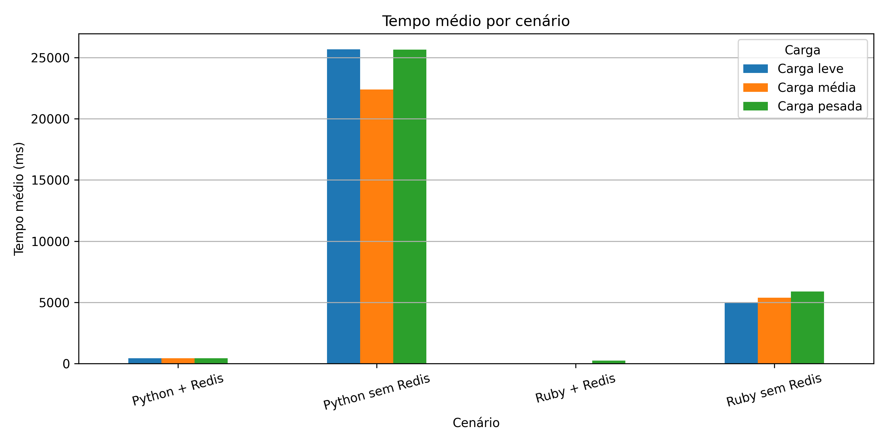

A comparação direta entre cenários deixa evidente o impacto do Redis: Python + Redis fica ~60× mais rápido que Python sem Redis. Ruby sem Redis, apesar de mais lento que os cenários com cache, apresenta tempo médio bem inferior ao Python sem Redis (~5.000 ms vs ~23.000 ms).

---

### P95 por Cenário e Nível de Carga

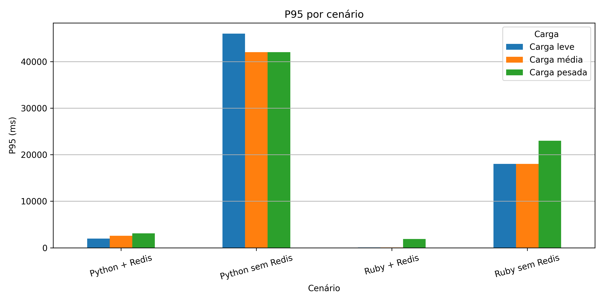

Os cenários sem Redis concentram os maiores P95 independente da linguagem, confirmando que a ausência de cache é o fator determinante para latências extremas. O P95 do Python sem Redis na carga leve supera 45.000 ms — mais de 14× o P95 do Ruby sem Redis no mesmo nível.

---

### Taxa de Falha por Cenário e Nível de Carga

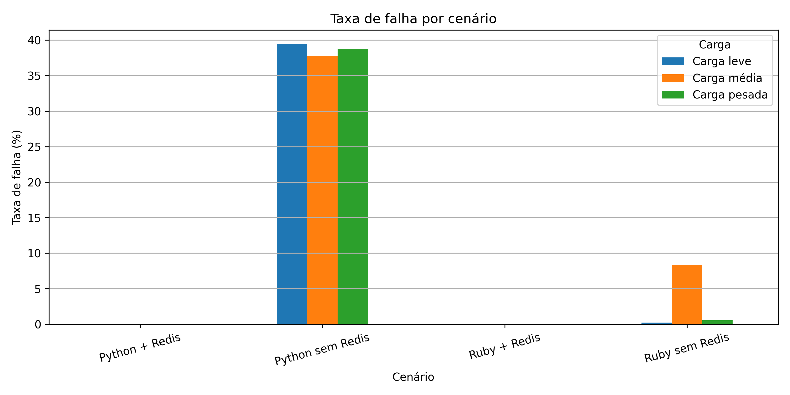

As falhas se concentram exclusivamente nos cenários sem Redis. Python sem Redis é consistentemente o pior, com ~39% em todas as cargas. Ruby sem Redis apresenta comportamento irregular — 0,3% na leve, pico de 8,3% na média, caindo para 0,6% na pesada — sugerindo instabilidade no serviço durante os testes.

---

### Tempo Médio de Resposta — Todos os Cenários por Nº de Usuários

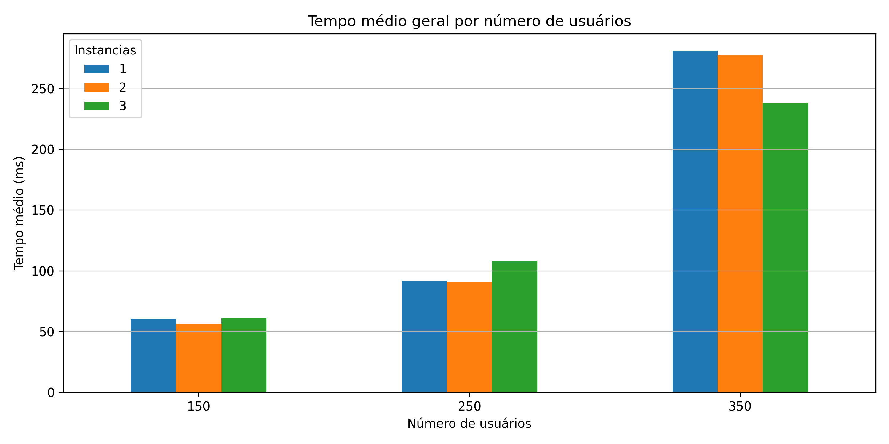

Python sem Redis apresenta tempo médio entre 22.000 e 25.000 ms em todos os níveis de carga, dominando completamente o gráfico. Python + Redis e Ruby + Redis ficam próximos de zero na escala, confirmando que o cache elimina praticamente toda a latência independente da quantidade de usuários.

---

### P95 de Tempo de Resposta — Todos os Cenários por Nº de Usuários

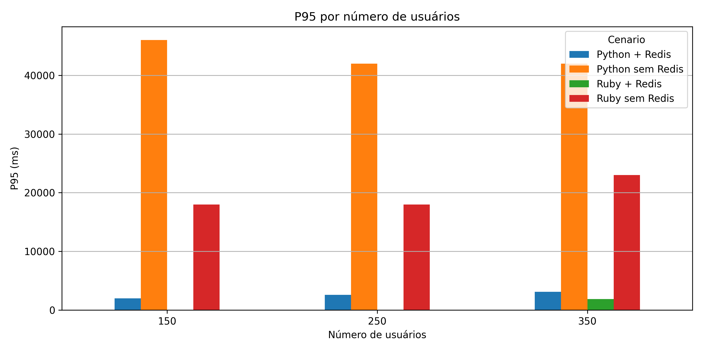

O P95 do Python sem Redis ultrapassa 40.000 ms já na carga leve, indicando que 5% das requisições mais lentas sofrem esperas extremas. Ruby sem Redis também apresenta P95 elevado (~18.000–23.000 ms), enquanto os cenários com Redis se mantêm abaixo de 3.200 ms em todos os níveis.

---

### Taxa de Falha — Todos os Cenários por Nº de Usuários

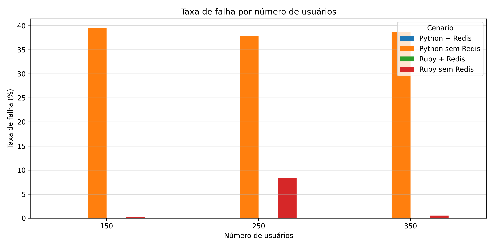

Python sem Redis registra cerca de 39% de falhas em todos os níveis de carga — o servidor simplesmente não consegue atender as requisições a tempo. Ruby sem Redis apresenta falhas pontuais de até 8,3% na carga média. Todos os cenários com Redis mantêm 0% de falha.

---

### Python — Tempo Médio: Com vs Sem Redis

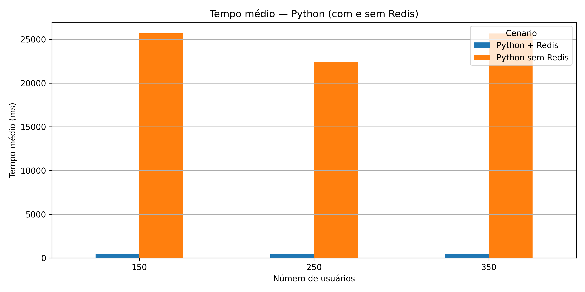

Com Redis, o serviço Python mantém ~420 ms constante nos três níveis de carga, sem degradação perceptível com o aumento de usuários. Sem Redis, o tempo médio oscila entre 22.000 e 25.000 ms — a diferença é de aproximadamente 55 a 60 vezes.

---

### Python — P95: Com vs Sem Redis

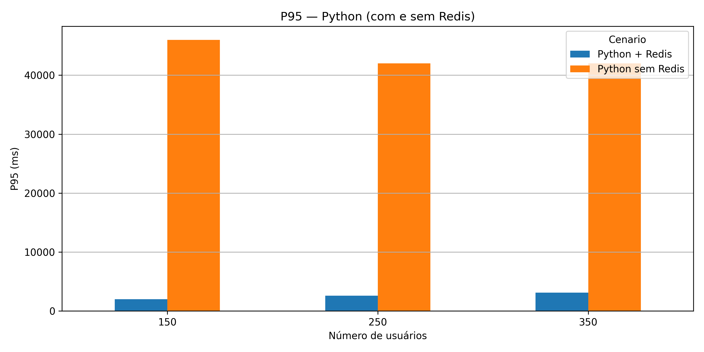

O P95 do Python com Redis fica abaixo de 3.200 ms em todos os cenários. Sem Redis, o P95 parte de 46.000 ms na carga leve e se mantém acima de 40.000 ms nos demais níveis, demonstrando que as requisições mais lentas são severamente impactadas.

---

### Python — Taxa de Falha: Com vs Sem Redis

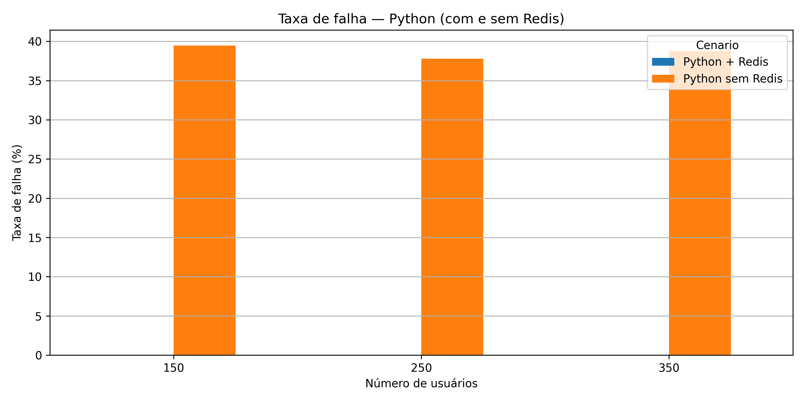

Python com Redis: 0% de falhas em todos os testes. Python sem Redis: ~39% de falhas constantes, independente da carga. O cache não apenas reduz a latência — ele é o que viabiliza o serviço Python em produção.

---

### Ruby — Tempo Médio: Com vs Sem Redis

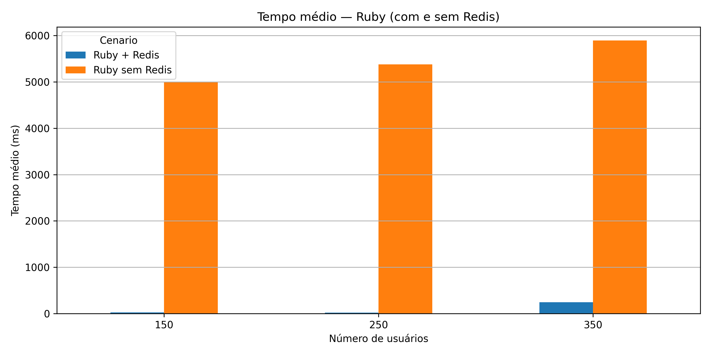

Ruby sem Redis apresenta tempo médio crescendo de ~5.000 ms (leve) para ~6.000 ms (pesado). Ruby com Redis fica abaixo de 30 ms nas cargas leve e média, subindo para ~250 ms na carga pesada — comportamento compatível com saturação de conexões no container.

---

### Ruby — P95: Com vs Sem Redis

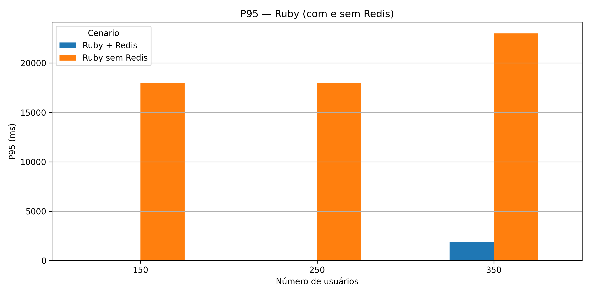

O P95 do Ruby sem Redis chega a 23.000 ms na carga pesada. Ruby com Redis mantém P95 muito baixo nas cargas leve e média, com elevação para ~1.700 ms na carga pesada — ainda dentro de limites aceitáveis, mas indicando pressão crescente.

---

### Ruby — Taxa de Falha: Com vs Sem Redis

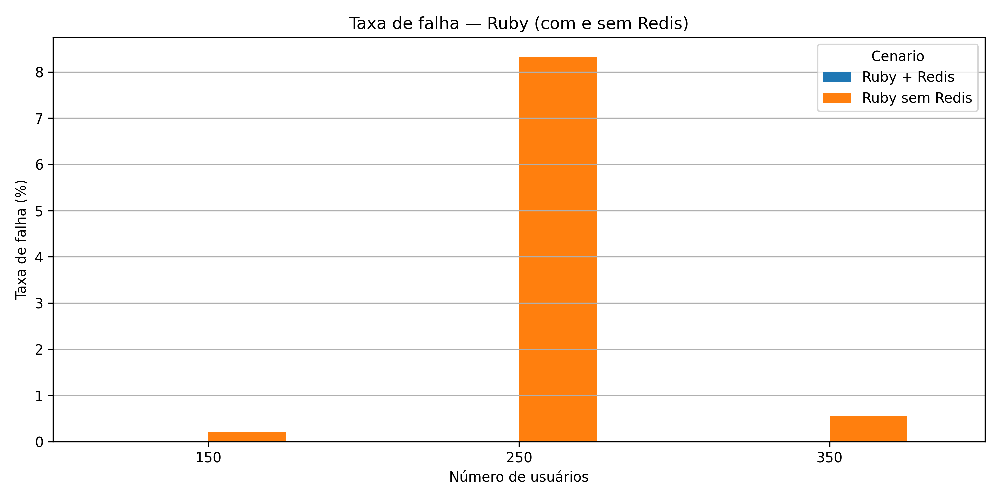

Ruby com Redis: 0% de falhas. Ruby sem Redis: pico de 8,3% na carga média, com comportamento irregular entre os níveis. A inconsistência nas falhas do Ruby sem Redis pode indicar instabilidade no serviço durante os testes realizados.

---

### Com Redis — Python vs Ruby (Tempo Médio)

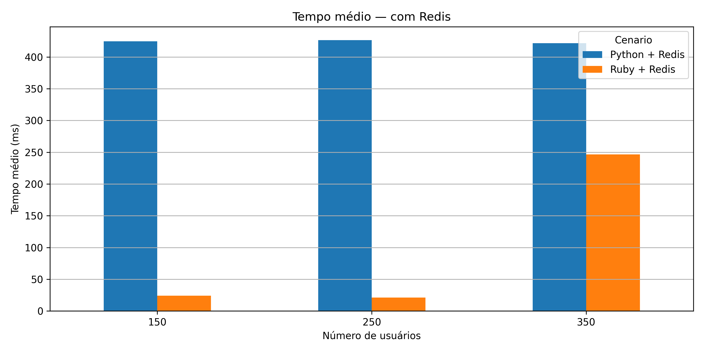

Com cache ativo, Ruby é consistentemente mais rápido que Python nas cargas leve e média (~25 ms vs ~420 ms). Na carga pesada, Ruby sobe para ~250 ms enquanto Python se mantém estável em ~420 ms. A diferença pode estar relacionada ao comportamento suspeito do Ruby + Redis nos primeiros níveis de carga.

---

### Sem Redis — Python vs Ruby (Tempo Médio)

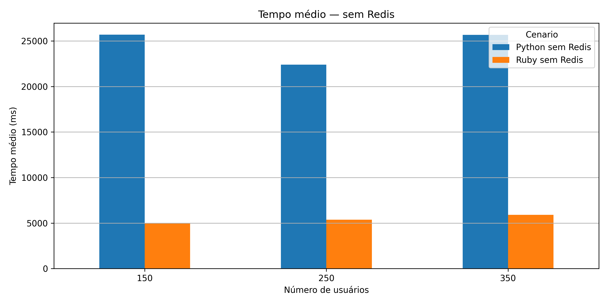

Sem cache, Python é significativamente mais lento que Ruby em todos os níveis (~23.000 ms vs ~5.500 ms). Ambos os cenários são inviáveis para uso em produção sob carga, mas o Ruby demonstra maior capacidade de resposta mesmo sem o benefício do cache.

---

## Conclusões

**Redis é indispensável** — O cache elimina praticamente toda a latência e as falhas. Sem Redis, ambas as APIs ficam inutilizáveis sob carga.

**Linguagem é fator secundário** — A presença ou ausência de cache impacta ordens de grandeza a mais do que a escolha de linguagem. Python com Redis e Ruby com Redis são ambos viáveis; Python sem Redis e Ruby sem Redis são ambos inaceitáveis.